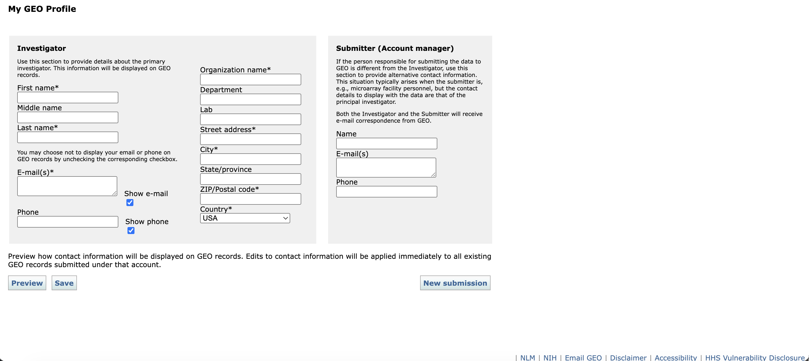
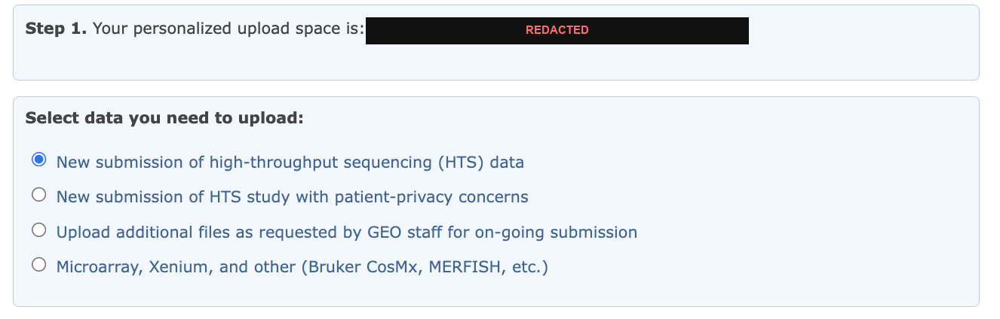
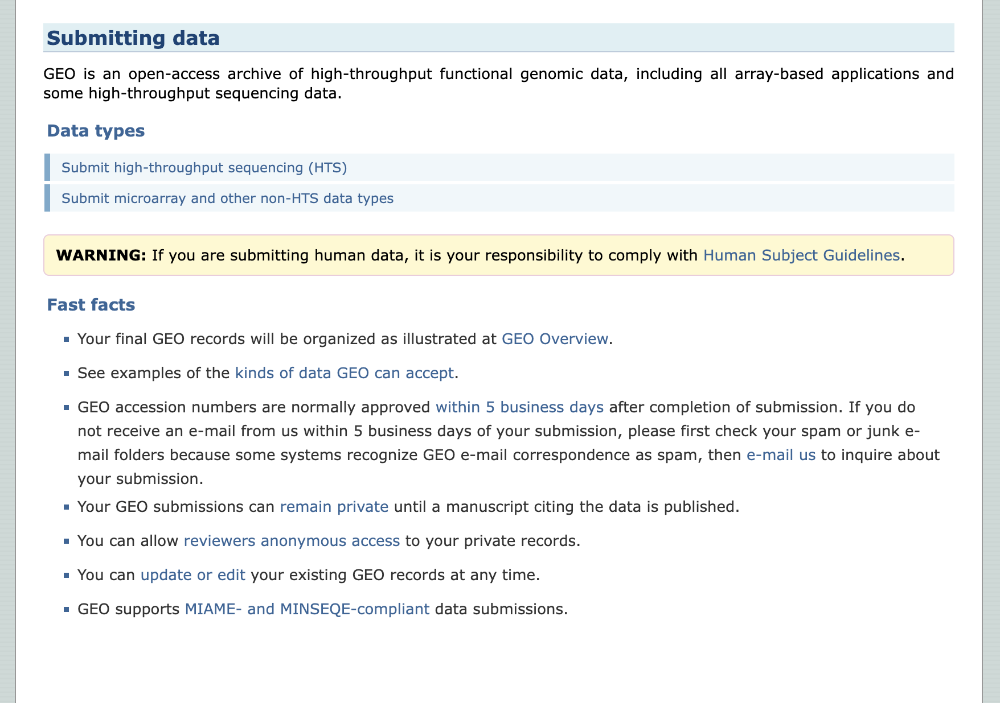
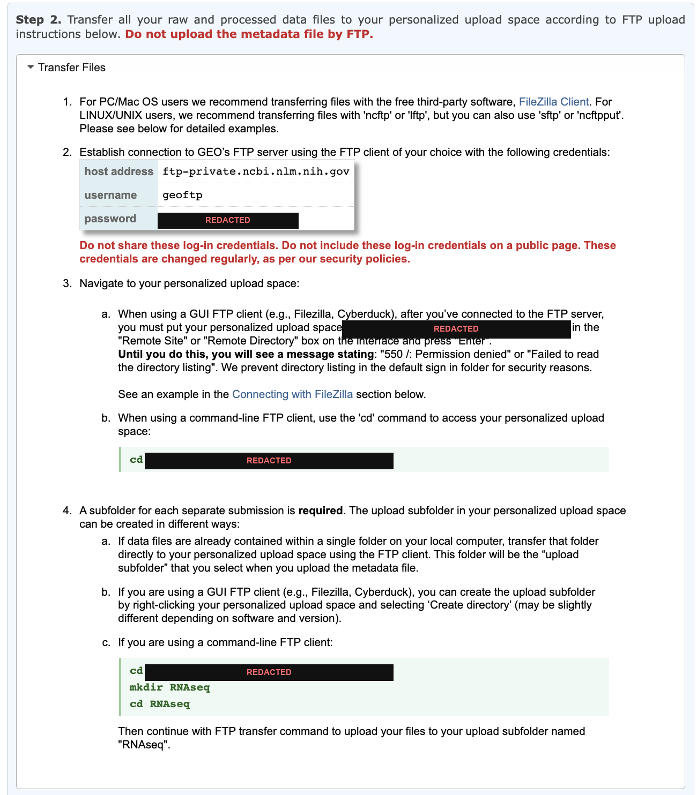
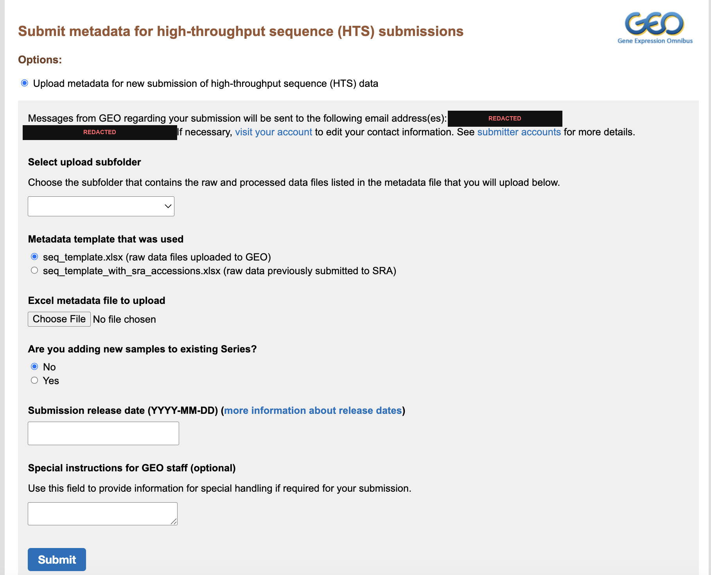

A step-by-step guide to depositing high-throughput sequencing data in the NCBI
Gene Expression Omnibus, from files on a cluster to an accession number in your
inbox. Written for people preparing their first GEO submission.

GEO's own documentation is authoritative and worth reading alongside this. The
links are collected at the [end](#reference). This guide covers what the steps
involve in practice and the points where submissions commonly stall.

**Contents**

1. [Before you start](#before-you-start)
2. [Account and upload space](#account-and-upload-space)
3. [What GEO accepts](#what-geo-accepts)
4. [Gather your files into one folder](#gather-your-files-into-one-folder)
5. [Fill in the metadata spreadsheet](#fill-in-the-metadata-spreadsheet)
6. [MD5 checksums](#md5-checksums)
7. [Upload over FTP](#upload-over-ftp)
8. [Check what arrived](#check-what-arrived)
9. [Submit the metadata spreadsheet](#submit-the-metadata-spreadsheet)
10. [What happens next](#what-happens-next)

---

## Before you start

Use a fresh Chrome incognito or private window for the whole submission
session, and keep it open from login until you press submit. NCBI's sign-in
interacts poorly with other sessions in the same browser profile, and the
resulting errors appear later and are hard to trace back.

---

## Account and upload space

Submission requires a My NCBI account linked to a GEO Profile. The link is
one-to-one, and the contact details in the profile are published on every record
you submit.

> Before you can submit to GEO, you must have a My NCBI account associated with
> a GEO Profile. Each My NCBI account can be associated with only a single GEO
> Profile, and all submissions made under your account will display the contact
> information contained in the GEO Profile.

Do this before you touch any data. Your personal FTP upload space is provisioned
per account and does not exist until you request it.

1. Sign in at [ncbi.nlm.nih.gov/geo/submitter](https://www.ncbi.nlm.nih.gov/geo/submitter/),
   or create an account.
2. Complete the GEO Profile. The **Investigator** block is what appears
   publicly. The **Submitter** block is for cases where the person uploading is
   not the principal investigator. Both receive GEO's correspondence.
3. Open the [FTP instructions page](https://www.ncbi.nlm.nih.gov/geo/info/submissionftp.html),
   tick the attestation checkbox, and request your personal upload space.
4. Note the upload space name. It has the form `uploads/yourname_abcd1234` and
   capitalisation matters.



*The GEO Profile. Investigator details appear publicly on every record.*



*Step 1 of the FTP page gives your upload space name, blacked out here. Choose
the first option for a standard sequencing submission.*

---

## What GEO accepts

**Raw data are required.** For sequencing, that means FASTQ, BAM or CRAM, with
FASTQ compressed using gzip or bzip2. Single-cell studies should be submitted as
FASTQ so the reads can be archived in SRA.

**Processed data must be quantitative.** This is the requirement submissions most
often fail.

> The processed data should have a quantitative component, such as gene
> abundances or other count data. Do not submit read alignments (e.g., BAM, SAM,
> BED) as processed data, as these are considered intermediary files and do not
> include a quantitative component.

For single-cell studies the processed data must be cell-level. GEO accepts
Market Exchange (MEX) triplets, HDF5 archives, and RDS objects. **Cell Ranger's
`filtered_feature_bc_matrix.h5` is an accepted processed data file** and is the
simplest option for 10x Genomics studies, since it carries the barcodes, features
and counts in a single file per sample. The MEX triplet
(`barcodes.tsv.gz`, `features.tsv.gz`, `matrix.mtx.gz`) is equally acceptable,
but each file must be prefixed with the sample name so that names stay unique
across the submission.

Two conditional requirements are easy to miss:

- If you used `cellranger aggr` and are submitting H5 files, you must also
  submit `aggregation.csv`.
- If your libraries include feature barcoding (ADT, HTO, CMO and similar) under a
  10x protocol, you must also submit `feature_reference.csv`, and each library
  goes on its own row in the spreadsheet (`sample1_GEX`, `sample1_ADT`).

### Limits and naming

| | |
|---|---|
| Maximum file size | 100 GiB — split anything larger |
| Maximum per subfolder | 5 TiB — split larger studies across submissions |
| Maximum samples per spreadsheet | 1,000 |
| Filename characters | `A–Z a–z 0–9 . _ -` only. No spaces. All names unique. |



*Submissions can stay private until publication, reviewers can be given
anonymous access, and accessions normally arrive within five business days.*

---

## Gather your files into one folder

GEO requires one subfolder per submission containing only the raw and processed
files listed in your spreadsheet. No nested directories, no archives, no extra
files.

Sequencing output rarely has that shape. FASTQ files usually sit in per-sample
or per-lane directories, and processed files sit under a separate pipeline
output tree. Symbolic links let you present the required flat structure without
duplicating the data: the links are created instantly regardless of file size,
consume no meaningful disk space, and leave the original directory layout
untouched, so nothing downstream that depends on those paths breaks. Copying
would double your storage footprint and take as long as the upload itself.

Create the folder and link each file into it:

```bash
mkdir geo_submission
ln -s /path/to/data/sample1/sample1_S1_L001_R1_001.fastq.gz geo_submission/
```

To link many files at once:

```bash
find /path/to/fastq -name '*.fastq.gz' -exec ln -s {} geo_submission/ \;
find /path/to/cellranger -name 'filtered_feature_bc_matrix.h5' -exec ln -s {} geo_submission/ \;
```

Cell Ranger writes the same filename for every sample, so link the processed
files individually with a name that identifies the sample:

```bash
ln -s /path/to/cellranger/sample1/outs/filtered_feature_bc_matrix.h5 \
      geo_submission/sample1_filtered_feature_bc_matrix.h5
```

Before moving on, confirm the folder is flat, complete and free of broken links:

```bash
ls geo_submission | wc -l                       # expected file count
find geo_submission -xtype l                    # broken links, should print nothing
find geo_submission -mindepth 1 -type d         # subdirectories, should print nothing
```

**GEO does not accept symbolic links in a submission.** The links are a local
staging device only. The upload command in
[step 7](#upload-over-ftp) dereferences them, so what reaches GEO's server is the
file each link points at.

---

## Fill in the metadata spreadsheet

Download the template from the
[HTS instructions page](https://www.ncbi.nlm.nih.gov/geo/info/seq.html). Fill it
in by hand. It contains worked examples for each assay type that are worth
reading before you start.

The **Metadata** sheet has four sections:

| Section | Contents |
|---|---|
| **STUDY** | Title, summary, experimental design, contributors. Becomes the public GSE record. |
| **SAMPLES** | One row per library; each row becomes a GSM. Add characteristic columns (sex, age, genotype, treatment) as needed, and as many `raw file` columns as your largest sample requires. |
| **PROTOCOLS** | Growth, treatment, extraction, library construction, data processing, genome build. These can be adapted from your methods section. |
| **PAIRED-END** | One row per lane per sample: R1 in the first column, R2 in the second. Index reads go in columns three and four if you are submitting them. |

Three rules are easy to violate:

- Every raw filename must appear exactly once in the SAMPLES section, and every
  file listed under PAIRED-END must also appear there.
- Every file in your upload subfolder must be listed in the spreadsheet. GEO
  states plainly: *"Do not upload extra files."*
- Anonymise the metadata. Do not include personally identifiable information.

Sample titles are easier to read if they follow a consistent pattern across the
study, for example `Organism, tissue, age, sex, condition, id: SAMPLE_NAME`.

---

## MD5 checksums

Checksums are optional, but they let GEO diagnose corruption if a file arrives
damaged.

> Providing the MD5 checksums for raw and/or processed files in the 'MD5
> Checksums' tab is optional. We only use checksums to troubleshoot when file
> corruption is detected in uploaded files. Do not submit MD5 checksums in
> separate file(s).

Compute them and paste the values into the **MD5 Checksums** tab of the
spreadsheet. Do not upload a checksum file — that would count as an extra file.

```bash
md5sum geo_submission/* > md5_checksums.txt     # Linux
md5 geo_submission/*    > md5_checksums.txt     # macOS
```

For a large submission this reads every byte and takes a while, so run it on a
compute node rather than a login node.

While you are reading every file anyway, it is worth testing that the gzip
streams are intact. A truncated FASTQ still has a valid gzip header and will
pass a superficial check, but fails on decompression:

```bash
gzip -t geo_submission/*.fastq.gz && echo "all archives intact"
```

---

## Upload over FTP



*Host address and username are the same for every submitter. The password is
per-session and rotates, so read it from your own logged-in page each time.*

Connect with `lftp` and enter the password when prompted:

```bash
lftp -u geoftp ftp-private.ncbi.nlm.nih.gov
```

The root of your upload space does not permit directory listing, so change into
it before creating anything. Otherwise you get a confusing permission error:

> Until you do this, you will see a message stating: "550 /: Permission denied"
> or "Failed to read the directory listing". We prevent directory listing in the
> default sign in folder for security reasons.

A subfolder for each submission is required. Give it a meaningful name:

```
cd uploads/YOURNAME_abcd1234
mkdir scRNAseq
cd scRNAseq
```

Then upload the staged folder:

```
mirror -R -L --parallel=4 /path/to/geo_submission .
```

`-L` follows the symbolic links and uploads the files they point at. Without it
`lftp` recreates the links themselves, and GEO receives a few hundred bytes of
path text in place of each file. The transfer reports success either way, so
this is worth getting right the first time.

`mirror` is resumable. If the connection drops, run the same command again and
only the missing or incomplete files transfer.

---

## Check what arrived

A successful exit status and a correct file count do not confirm a good upload.
Compare file sizes on both ends.

In the same `lftp` session:

```
cls -s --block-size=1
```

Compare that against your local sizes:

```bash
ls -lL geo_submission | awk '{print $9, $5}' | sort
```

Any file smaller on the server than on disk was truncated in transfer. Re-run the
`mirror` command, which resends only the affected files.

---

## Submit the metadata spreadsheet

The spreadsheet is uploaded through the website, not by FTP.

> Do not upload the metadata file by FTP.

Go to
[submit.ncbi.nlm.nih.gov/geo/submission/meta](https://submit.ncbi.nlm.nih.gov/geo/submission/meta/)
in the same browser session and complete four fields:

1. **Upload subfolder** — select the folder you filled. If the list is empty,
   the FTP transfer has not registered yet, or you are in a different browser
   session from the one that created it.
2. **Template used** — `seq_template.xlsx` for raw data uploaded to GEO, or
   `seq_template_with_sra_accessions.xlsx` if the raw data is already in SRA.
3. **The spreadsheet.** Close it in Excel first, so you do not upload a stale
   copy.
4. **Release date.** See the note below.



*The metadata submission form. The email addresses shown are taken from your GEO
Profile and receive all subsequent correspondence.*

GEO releases a private Series automatically on its release date, without
prompting. If your manuscript has not been published by then, the data becomes
public anyway. Set a date comfortably far ahead — you can release earlier at any
time — and note it somewhere you will see it.

---

## What happens next

1. **Automated validation**, within minutes to hours. GEO checks that the files
   listed in your spreadsheet exist on the server and parse correctly. You are
   emailed either way.
2. **If errors are reported, you have two weeks.** GEO removes incomplete
   submissions from the server after that. Keep your spreadsheet in case you need
   to resubmit.
3. **Accession within five business days.** The letter contains your
   `GSEnnnnnn` and instructions for creating a reviewer access token, which is
   what journals ask for when they request reviewer access to unpublished data.
   You do not need to request the token separately.
4. **Your submission is not visible on the GEO website** until it has been
   accessioned and approved. This is expected; do not resubmit.

If nothing arrives after five business days, check your spam folder before
contacting GEO. Their correspondence is frequently filtered.

---

## Reference

| | |
|---|---|
| [Submitter login and GEO Profile](https://www.ncbi.nlm.nih.gov/geo/submitter/) | Account, profile, new submission |
| [HTS submission instructions](https://www.ncbi.nlm.nih.gov/geo/info/seq.html) | Data type rules, spreadsheet download |
| [FTP instructions](https://www.ncbi.nlm.nih.gov/geo/info/submissionftp.html) | Upload space and credentials; login required |
| [Submit metadata](https://submit.ncbi.nlm.nih.gov/geo/submission/meta/) | The final step |
| [GEO FAQ](https://www.ncbi.nlm.nih.gov/geo/info/faq.html) | Release dates, reviewer access, updating records |

GEO revises these pages without notice. Where this guide and GEO disagree, GEO
is correct.

Corrections and additions are welcome through the
[repository](https://github.com/dayuan-wang/ncbi-geo-submission-tutorial).
Maintained by [Dayuan Wang](https://dayuan-wang.github.io/).
